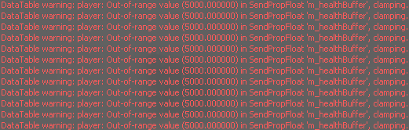

# Health Buffer Fix

* About:
  * Fix the issue where health buffer display cannot exceed 200.
  * Fix that changing pain_pills_decay_rate causes changes to the current health buffer.
  * **When pain_pills_decay_rate is 0, health buffer display fix will be disabled.**

* Applicable to:
  * L4D2
  * *L4D1? (Is there also such a problem? Not tested)*

* Example:
  * Before:
   
   
  * After:
   

* Installation:
  1. Put the l4d2_healthbuffer_fix.smx in your servers \addons\sourcemod\plugins\ folder.
