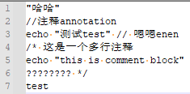
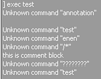
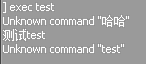

# Parse Line Fix

* About:
  * Fix non ASCII characters in cfg file that cannot be executed.
  * Interpret /* */ as a comment block.

* Applicable to:
  * L4D1
  * L4D2

* Example:
  * CFG file:
  <br/>
  * Before:
  <br/>
  * After:
  <br/>

* ConVars:
  ```php
  // Interpret /* */ as a comment block
  l4d2_parseline_fix_blockcomment "1"

  // Parse Line Fix Plugin Version
  l4d2_parseline_fix_version
  ```

* Requirements:
  1. SourceMod 1.11.6820+ or [DHooks](https://forums.alliedmods.net/showpost.php?p=2588686)

* Installation:
  1. Put the l4d2_parseline_fix.txt in your servers \addons\sourcemod\gamedata\ folder.
  2. Put the l4d2_parseline_fix.smx in your servers \addons\sourcemod\plugins\ folder.
