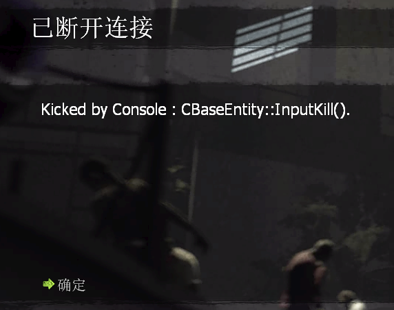

# Prevent Input Kill

* About:
  * Prevent players from being removed (*Kicked by Console : CBaseEntity::InputKill()*).
  * Using the simplest method to achieve the best results.
  * Can prevent any form of Input Kill, can prevent VScript .Kill(), Even the RemoveEntity() of SourceMod plugin.

* Applicable to:
  * L4D1
  * L4D2

* Example:
  * Before:
  <br/>

* ConVars:
  ```php
  // Conditions for Preventing Client Deletion.
  // 0 = Either team condition OR type condition is met
  // 1 = Both team condition AND type condition must be met
  l4d2_prevent_inputkill_mode "0"

  // Teams to Protect from Deletion.
  // (Add the values of the teams you wish to protect)
  // 1 = Spectator (Team 1)
  // 2 = Survivor (Team 2)
  // 4 = Infected (Team 3)
  // 8 = Passing L4D1 Survivor (Team 4)
  l4d2_prevent_inputkill_team "2"

  // Client Types to Protect from Deletion.
  // (Add the values of the client types you wish to protect)
  // 1 = Human Player
  // 2 = Bot
  l4d2_prevent_inputkill_type "1"

  // Prevent Input Kill Plugin Version
  l4d2_prevent_inputkill_version
  ```

* Installation:
  1. Put the l4d2_prevent_inputkill.smx in your servers \addons\sourcemod\plugins\ folder.
  2. Auto create l4d2_prevent_inputkill.cfg in your servers \cfg\sourcemod\ folder after the plugin running.
